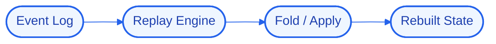

# EventReplay
### Event-sourced state reconstruction by replaying the event log deterministically.


## 📖 Overview
EventReplay treats the event log as the source of truth and rebuilds current state — or any past state — by replaying events deterministically, enabling recovery and time-travel debugging.

> Part of my Senior Hybrid Engineer 2026 portfolio (`#56`). Built on the "Antigravity" model — logic, state, and UI run locally in Docker while heavy reasoning is offloaded to cloud APIs, so the whole system runs on modest hardware.

## 🚀 Quick Start
```bash
# 1. Clone
git clone https://github.com/Kimosabey/event-replay.git
cd event-replay

# 2. Install
# (see docs/GETTING_STARTED.md for the full setup)

# 3. Run
docker compose up
```

## ✨ Key Features
- Event log as source of truth
- Deterministic state rebuild
- Point-in-time (time-travel) state
- Recovery after corruption

## 🏗️ Architecture


Guaranteeing deterministic replay so the same log always yields the same state.

See [docs/ARCHITECTURE.md](./docs/ARCHITECTURE.md) for the full HLD/LLD and design decisions.

## 🧰 Tech Stack
| Layer | Technology | Role |
| :--- | :--- | :--- |
| Kafka | `Kafka` | Durable event-streaming backbone |
| Postgres | `Postgres` | Relational source of truth |

## 📚 Documentation
- [Architecture](./docs/ARCHITECTURE.md) — high- and low-level design, decision log
- [Getting Started](./docs/GETTING_STARTED.md) — prerequisites, setup, environment
- [Failure Scenarios](./docs/FAILURE_SCENARIOS.md) — fault analysis and recovery
- [Interview Q&A](./docs/INTERVIEW_QA.md) — deep-dive walkthrough

## 🔭 Future Enhancements
- Snapshots for fast replay
- Schema-evolution handling
- Replay diffing

## 📄 License
Released under the MIT License.

## 👤 Author

**Harshan Aiyappa**
Senior Full-Stack Hybrid AI Engineer
Voice AI • Distributed Systems • Infrastructure

[](https://kimo-nexus.vercel.app/)
[](https://github.com/Kimosabey)
[](https://linkedin.com/in/harshan-aiyappa)
[](https://x.com/HarshanAiyappa)
