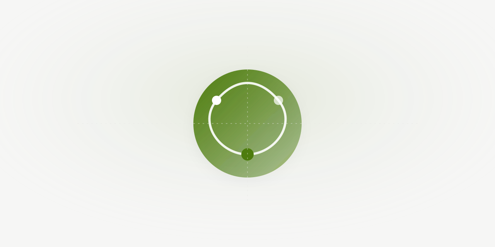
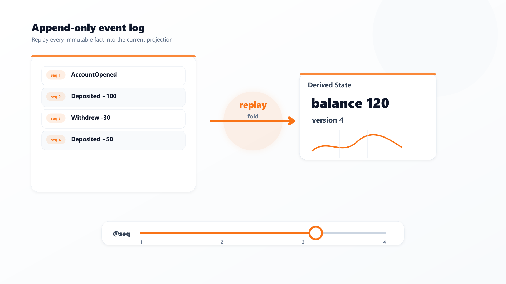
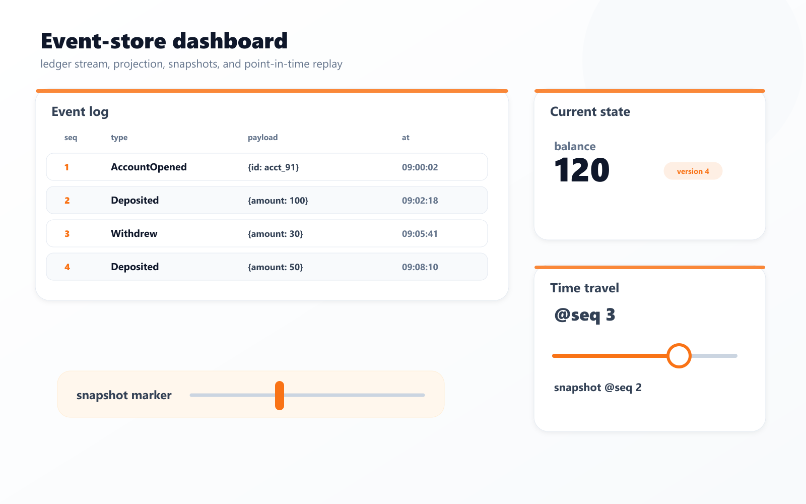
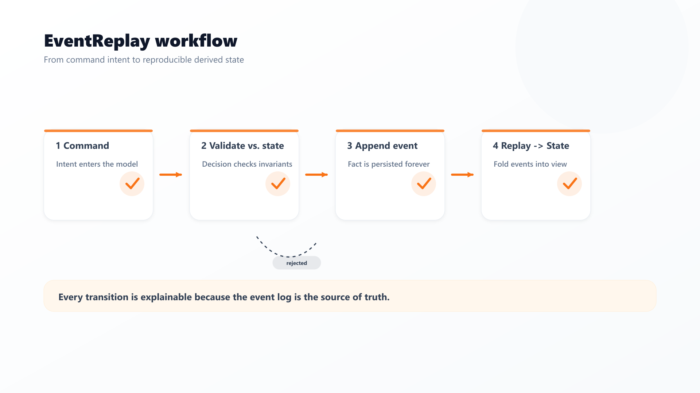
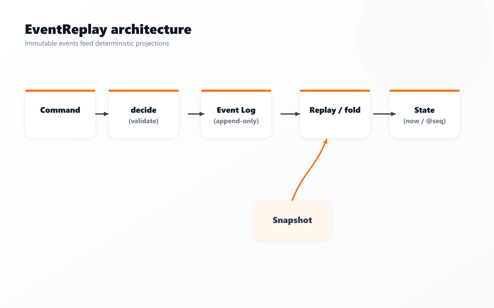
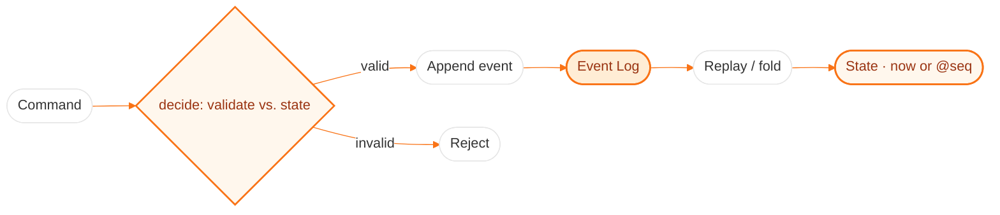

# EventReplay
### Event-sourced state reconstruction — the log is the source of truth; state is just a replay of it.




## 📖 Overview



Instead of storing current state and mutating it, EventReplay stores an **append-only log of events** and
derives state by folding that log. That makes three things fall out for free: **deterministic replay**
(same log → same state), **time-travel** (rebuild state as of any point in the past), and **recovery**
(rehydrate from the log after a crash). **Snapshots** keep replay fast on long logs.

Modeled on a classic account-ledger aggregate with a proper write side — commands are validated against
current state and either append one event or are rejected (a rejected command never touches the log).

> Part of my Senior Hybrid Engineer 2026 portfolio (`#56`). Distributed-systems fundamentals under the
> Antigravity model — pure, deterministic logic that runs anywhere.

## 🚀 Quick Start
```bash
git clone https://github.com/Kimosabey/event-replay.git
cd event-replay

npm test          # 10 tests, zero dependencies (Node 22 runs the TS directly)
npm run demo      # replay, time-travel, and snapshot equivalence, proven live
docker compose up # serve the HTTP API on :4000
```

### API
```bash
curl -s localhost:4000/commands -H 'content-type: application/json' -d '{"type":"Open","owner":"harshan"}'
curl -s localhost:4000/commands -H 'content-type: application/json' -d '{"type":"Deposit","amount":100}'
curl -s localhost:4000/state          # current state
curl -s "localhost:4000/state?at=2"   # time-travel: state as of seq 2
curl -s localhost:4000/events         # the full event log
```

### Demo output
```
event log:
  {"type":"AccountOpened","owner":"harshan","seq":1,...}
  {"type":"Deposited","amount":100,"seq":2,...}
  {"type":"Withdrew","amount":30,"seq":3,...}
  {"type":"Deposited","amount":50,"seq":4,...}
current balance: 120
balance @seq 2 (after first deposit): 100
snapshot rebuild == full rebuild: true
replay is deterministic: true
overdraft rejected: insufficient funds | log length still 4
```

## ✨ Key Features



- **Append-only event log** as the single source of truth.
- **Deterministic replay** — folding the same log always yields the same state (property-tested).



- **Time-travel** — rebuild state as of any sequence number.
- **Snapshots** — rebuild from the latest snapshot + remaining events; equals a full rebuild for every target.
- **Command validation** — invalid commands (overdraft, closed account) are rejected and never recorded.
- **Recovery** — a fresh store loaded from the log reproduces state exactly.

## 🏗️ Architecture




The hard part is **deterministic replay**: state must be a pure fold of events, with all non-determinism
(timestamps) injected — so the same log always rebuilds identically. See [docs/ARCHITECTURE.md](./docs/ARCHITECTURE.md).

## 🧰 Tech Stack
| Layer | Technology | Role |
| :--- | :--- | :--- |
| Runtime | Node.js 22 (TypeScript, no build step) | Type-stripped execution + built-in test runner |
| Core | Pure reducer + append-only store | Deterministic event sourcing |
| Transport | Node `http` | Zero-dependency command/query API |
| Container | Docker + Compose | One-command run |

## 📚 Documentation
- [Architecture](./docs/ARCHITECTURE.md) — event sourcing, replay, snapshots, CQRS write side
- [Getting Started](./docs/GETTING_STARTED.md) · [Failure Scenarios](./docs/FAILURE_SCENARIOS.md) · [Interview Q&A](./docs/INTERVIEW_QA.md)

## 🔭 Future Enhancements
- Durable log backend (append to disk / Kafka)
- Automatic snapshotting every N events
- Multiple aggregate types + projections
- Optimistic concurrency (expected-version on append)

## 📄 License
Released under the MIT License.

## 👤 Author

**Harshan Aiyappa**
Senior Full-Stack Hybrid AI Engineer
Voice AI • Distributed Systems • Infrastructure

[](https://kimo-nexus.vercel.app/)
[](https://github.com/Kimosabey)
[](https://linkedin.com/in/harshan-aiyappa)
[](https://x.com/HarshanAiyappa)
