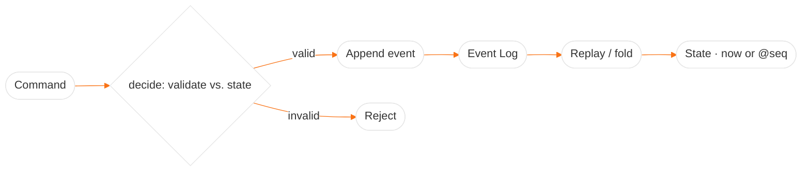

# Architecture — EventReplay

## High-Level Design (HLD)
EventReplay treats an **append-only event log** as the single source of truth. Current state (or any past
state) is a **deterministic fold** of that log — which gives replay, time-travel, and recovery for free.
Snapshots keep replay fast on long logs. Commands are validated against current state before an event is
appended (the CQRS write side).

## Low-Level Design (LLD)
- **`domain.ts`** — `Event` / `EventInput` union, `State`, `apply(state, event)` (the pure reducer), and
  `decide(state, command)` (validate → produce an event, or throw).
- **`eventStore.ts`** — append-only log; `append()` stamps a monotonic `seq` and a timestamp from an
  **injectable clock** (so tests are deterministic); `upTo(seq)` and `load()` (recovery).
- **`replay.ts`** — `rebuild(events)`, `rebuildUpTo(events, seq)` (time-travel), `snapshot(events, seq)`,
  and `rebuildFrom(snapshot, events, targetSeq)` (snapshot-accelerated).
- **`account.ts`** — the aggregate: derives state from the log and appends validated commands.
- **`server.ts`** — Node `http`: `POST /commands`, `GET /state[?at=seq]`, `GET /events`, `GET /health`.

## Decision Log
- **State is a pure fold, timestamps are injected** — the only source of non-determinism (the clock) is a
  constructor argument, so replay is provably deterministic (same log → same state).
- **Command validation on the write side** — invalid commands (overdraft, closed account) throw and are
  **never appended**, so the log only ever contains facts that actually happened.
- **Snapshots as an optimization, not a source of truth** — `rebuildFrom(snapshot, …)` is tested to equal a
  full `rebuildUpTo(…)` for every target seq, so snapshots can never drift from the log.
- **In-memory store for the demo** — the store is an interface-shaped seam; a durable log (disk/Kafka) is a
  listed future enhancement.

## Concept Deep Dive
The guarantee that matters is **deterministic replay**. If `apply` is pure and all non-determinism is
injected, the log becomes an authoritative, replayable history — enabling time-travel debugging (`@seq`) and
crash recovery (rehydrate a fresh store from the log).
